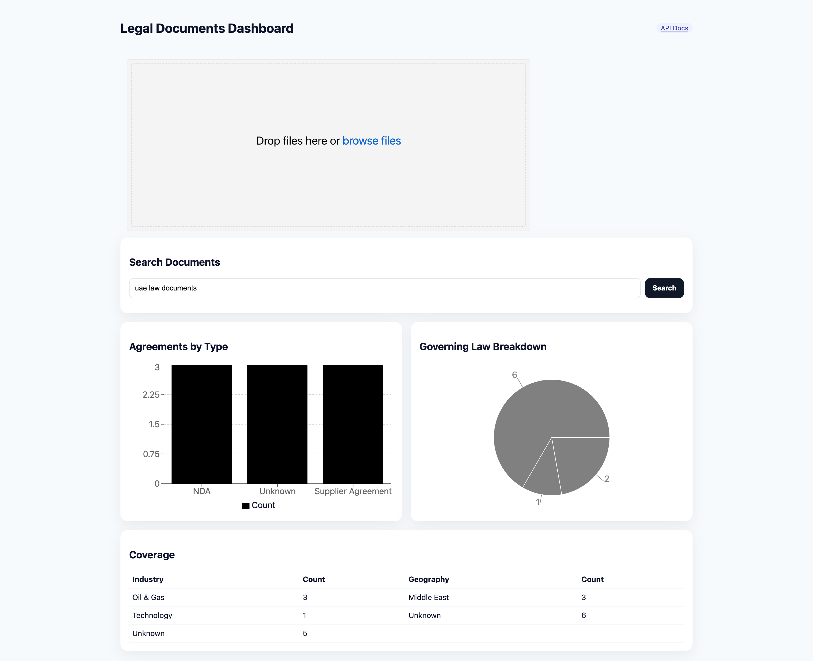
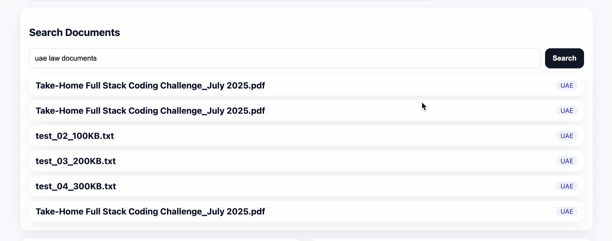
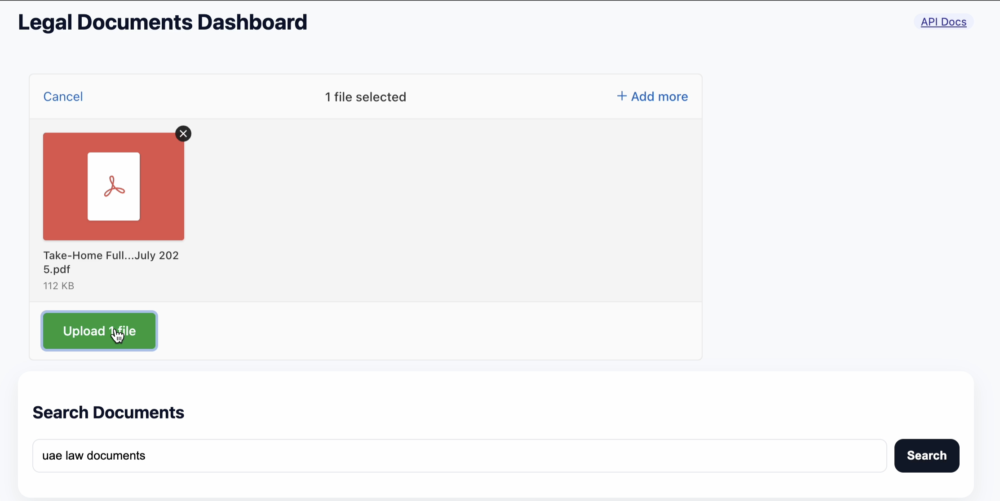

# Legal Documents Dashboard — Qanooni.ai 
 

## High-Level Architecture

```
Frontend (Vite + React + TypeScript)
  ├─ Upload (drag & drop, progress, progressBar from uppy framework)
  ├─ Interrogation View (question -> dynamic table)
  └─ Dashboard (charts & tables from a single aggregated API)


Backend (FastAPI + SQLite)
  ├─ /api/v1/upload       (bulk multi-file upload -> parse & extract metadata)
  ├─ /api/v1/query        (natural-language-ish query)
  ├─ /api/v1/dashboard    (aggregated insights for charts)
  ├─ /healthz, /readyz    (probes)
  └─ /metrics             (Prometheus)
Storage
  ├─ SQLite (dev) -> **Postgres** (prod)
  ├─ Local files (dev) -> **S3** (prod)
```

### Design Choices

- Dependency Injection and Repository Patten

- **FastAPI + Gunicorn/Uvicorn** ASGI server with graceful shutdown, request timeouts and body limits.



- **SQLite** for storing documents information. Migrations and models are portable to **Postgres**.


- **Batch/aggregate APIs** to avoid N+1 fetches from the frontend. This can further be enhanced using a Redis Cache query. The dashboard is computed server-side in one call.

- **Backpressure & safety nets**: request size limits, rate-limiting middleware (in-memory for dev; recommend ingress / API gateway rate-limits in prod).

- **Observability**: Prometheus `/metrics`, structured JSON logs, request IDs, health/readiness probes. Hooks provided for OpenTelemetry tracing.

- **Resilience patterns**: bounded retries, exponential backoff, server timeouts.

- **Background processing**: The current ingestion uses an in-memory background tasks queue; can be offloaded to Celery/RQ with Redis via `tasks/` for large volumes. 


- **Security**: CORS allowlist, content-type & size checks, basic rate limiting, dependency pinning, headers that disable sniffing, and robust error handler.

- **Blue/Green & Canary**: In Production, containers can be launched stateless; DB migrations are additive-forward. K8s manifests include rolling updates and HPA example.

- **Scalability path**: Will swap SQLite for **Postgres**, move blobs to **S3**, add **Redis** for queues, **vector DB** and Elasticsearch for semantic search, and real LLM integration.

---

### How to run

**Backend**
(Use python 3.10 or later)
```bash
cd backend
python -m venv .venv && source .venv/bin/activate
pip install -r requirements.txt
uvicorn app.main:app --reload --host 127.0.0.1 --port 8000
```

**Frontend**

```bash
cd frontend
npm i
npm run dev
```

---

### Things to improve upon

- Avoid having same files (checking content. But, impossible for huge files)
- Having filters for search to choose type/tags on documents.
---

## Production Deployment Notes

This service can be scaled horizontally by running multiple Gunicorn/Uvicorn workers across several containers behind a load balancer and keeping the app stateless with shared services (Postgres, Redis, S3).

Using readiness/liveness probes and rolling updates for zero‑downtime, and enforce timeouts, request size limits, and gzip/brotli at the proxy.

- Use **Postgres** in place of SQLITE; see env vars and code comments. Use **S3** for document storage; update `STORAGE_BACKEND`.

- Put **API Gateway / Nginx** in front for TLS termination, request/response limits, gzip/brotli, and **rate limits**.

- Enabling **OpenTelemetry** exporters (OTLP) to scrape from Prometheus `/metrics`. Grafana dashboards included.

- **Zero-downtime**: rolling deployments (K8s manifests), readiness gates only after DB connectivity established and migrations applied.

---

## Tests

```bash
PYTHONPATH=backend pytest -q
```

---

## Future Improvements

- Swapping out mock NLP with real **LLM** via API; 
- Ingestion can be **queued** with worker autoscaling. Upload are queued in background_tasks; progress via polling or server-sent events can be done for huge files.
- Replace Text Search with **vector search** (or Elasticsearch with LLM Integrations). Embeddings can be generated asynchronously.


